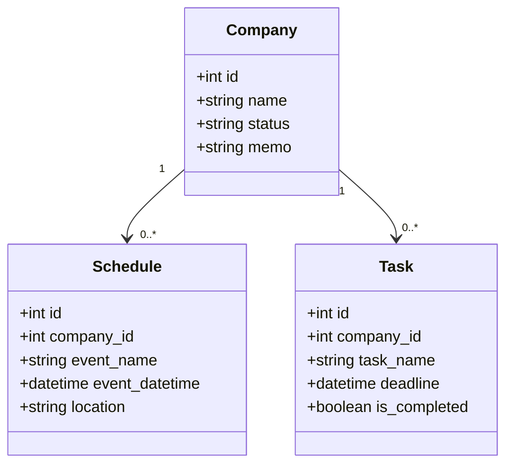
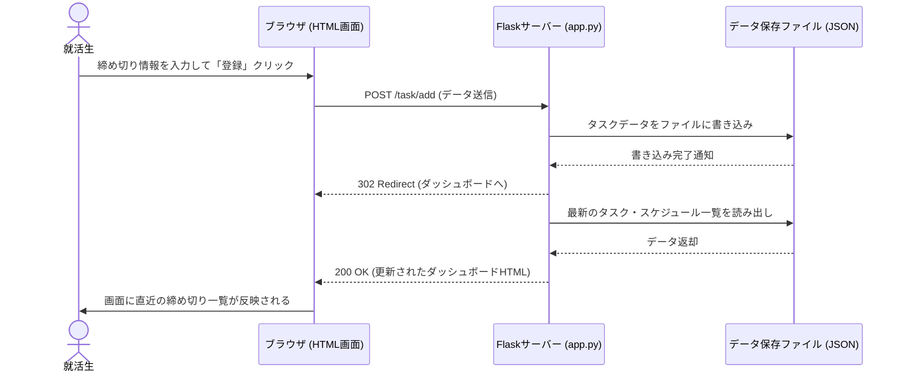
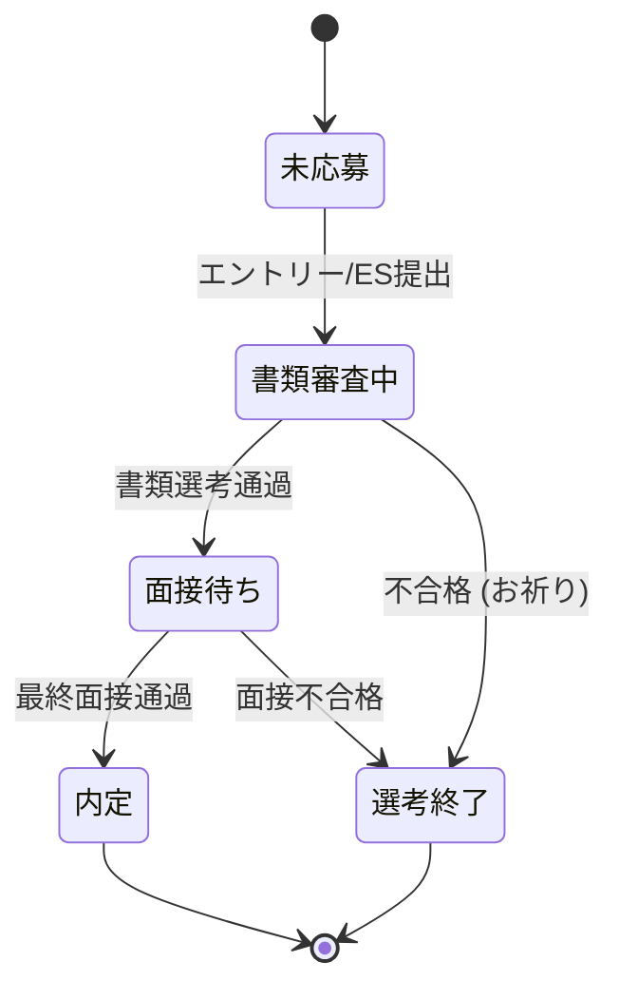

# 就活管理（インターン特化版）アプリ - 要件定義書 & 設計仕様書

就活（特にインターン時期）の過密なスケジュールや、ES・WEBテストの締め切りをごちゃごちゃにせず、一目で直近のタスクを把握するための自分専用管理アプリです。

## 1. 要件定義

### ① 目的（ゴール）
すべてのインターン・選考スケジュールを入力し終えて、一覧画面（ダッシュボード）を確認するだけで、直近の締め切りや次に受けるべきイベントが完璧に把握できること。

### ② 利用者（ターゲット）
開発者本人（自分専用アプリのため、認証・ログイン機能は不要とする）。

### ③ 主要機能一覧（優先度付き）
- **【優先度：高】直近の締め切り・予定の一覧表示機能（ダッシュボード）**
  - アプリを開いてすぐに「あと何日か」がわかる直近のタスクリスト。
- **【優先度：高】締め切りタスク管理機能（ES・WEBテストなど）**
  - タスク内容、期限を登録・編集・削除できる。
- **【優先度：中】イベントスケジュール管理機能（面接・インターン当日など）**
  - 面接日時、場所（URL）を登録・編集・削除できる。
- **【優先度：中】応募企業一覧および選考ステータス管理機能**
  - 企業名、現在の選考状態（書類審査中、面接待ち、内定など）、簡単なメモを管理。

### ④ 入出力データ構造
- **入力項目**: 企業名、イベント/タスク名、期限/日時、場所/URL、ステータス、メモ
- **出力項目**: 直近締め切りタスク一覧、スケジュールリスト、ステータス別企業一覧

### ⑤ 受け入れ基準（完成の目安）
PCのブラウザからフォームで各種情報を入力し、「登録完了」ボタンを押すとダッシュボードの一覧リストに即座に追加され、ブラウザをリロード（ページ更新）してもデータが消えずに残っている状態。

### ⑥ 非目標（やらないこと）
- 日常のプライベートな予定のスケジュール管理は対象外とする。
- 期限が近づいた際の「自動メール通知機能」や「プッシュ通知機能」は、今回の授業課題の範囲外（手動でアプリを開いて確認する運用）とする。

### ⑦ 非機能要求（環境・制約）
- **動作環境**: ローカルPC環境のブラウザ（Chrome推奨）
- **開発言語**: Python 3.x
- **フレームワーク**: Flask
- **データ保存**: 簡易的なローカルファイル（JSON等）による永続化

---

## 2. 設計図

### ① ユースケース図

### ② クラス図

### ③ シーケンス図

### ④ 状態遷移図

3. COSMIC CFP 機能規模見積もり
本アプリの主要機能に基づく、COSMIC機能規模測定（算出結果：31 CFP）

データグループ (Data Groups)
Company: 企業情報（ステータス、メモ）

Schedule: 面接・イベント予定情報

Task: 締め切りタスク情報

機能プロセスとデータ移動の測定
企業情報の登録・編集機能 (3 CFP)

Entry (ユーザーからの入力データ送信)

Write (Companyデータグループへの書き込み)

Exit (登録完了メッセージの画面表示)

企業一覧・ステータス表示機能 (2 CFP)

Read (Companyデータグループの読み出し)

Exit (ステータス別一覧の画面表示)

締め切りタスクの登録機能 (4 CFP)

Entry (タスク入力データの送信)

Read (紐づくCompanyの存在確認)

Write (Taskデータグループへの書き込み)

Exit (ダッシュボードへのリダイレクト表示)

スケジュール・イベントの登録機能 (4 CFP)

Entry (イベント入力データの送信)

Read (紐づくCompanyの存在確認)

Write (Scheduleデータグループへの書き込み)

Exit (ダッシュボードへのリダイレクト表示)

総合ダッシュボード画面表示機能 (5 CFP)

Read (Taskデータの読み出し)

Read (Scheduleデータの読み出し)

Read (Companyデータの読み出し)

Exit (直近の締め切り一覧・予定の画面表示)

Exit (残り日数の計算結果表示)

各種データの削除機能 (3機能 × 3 CFP = 9 CFP)

企業、タスク、予定の各削除プロセスにおいて、それぞれ Entry(ID送信), Write(データ削除), Exit(画面更新) が発生。

選考ステータスの更新機能 (4 CFP)

Entry (ステータス変更送信)

Read (対象企業の読み出し)

Write (変更後のステータス書き込み)

Exit (一覧画面の更新表示)

合計機能規模: 3 + 2 + 4 + 4 + 5 + 9 + 4 = 31 CFP

## 3. 開発・実装
### 現在動く機能
-[1]-  企業の登録と一覧表示（土台作成 ＆ 入力検証・エラー表示付き）
-[2]-  締め切りタスク（Task）の管理機能
-[3]-  イベントスケジュール管理機能（面接・インターン当日など）
-[4]-  応募企業一覧および選考ステータス管理機能（詳細変更・メモ更新など）

### 起動方法
python app.py

### [1]の動作確認
1. ブラウザで http://127.0.0.1:5000　を開く
2. 企業名、現在の状態を入力して確認
3. 企業名を入力しない状態でのエラー表示を確認

### [2]の動作確認
1. ブラウザで http://127.0.0.1:5000　を開く
2. 企業名、タスク内容、締め切り期限を設定して確認
3. タスクの期限までの日数が表示されることを確認

### [3]の動作確認
1. ブラウザで http://127.0.0.1:5000　を開く
2. 企業名、イベント名、日時、場所を設定して確認
3. 直近の予定を開催が近い順に表示されていることを確認

### [4]の動作確認
1. ブラウザで http://127.0.0.1:5000　を開く
2. 登録企業が現在の選考状態ごとにグループ分けされていることを確認
3. 選考状態及びメモの更新を保存することができることを確認

## 完成したコード

### Pythonコード
from flask import Flask, render_template, request, redirect, url_for, flash
import json
import os
from datetime import datetime

app = Flask(__name__)
app.secret_key = 'job_hunting_app_secret_key_for_pbl'

DATA_FILE = 'data.json'

def load_data():
    if not os.path.exists(DATA_FILE):
        return {"companies": [], "tasks": [], "schedules": []}
    try:
        with open(DATA_FILE, 'r', encoding='utf-8') as f:
            return json.load(f)
    except json.JSONDecodeError:
        return {"companies": [], "tasks": [], "schedules": []}

def save_data(data):
    with open(DATA_FILE, 'w', encoding='utf-8') as f:
        json.dump(data, f, ensure_ascii=False, indent=4)

# ─── ルーティング ───

@app.route('/')
def index():
    """最終版ダッシュボード：タスク、スケジュール、およびステータス別企業一覧"""
    data = load_data()
    
    company_map = {c['id']: c['name'] for c in data['companies']}
    
    # --- タスクデータの処理 (ステップ2) ---
    today = datetime.now().date()
    display_tasks = []
    for t in data['tasks']:
        try:
            deadline_date = datetime.strptime(t['deadline'], '%Y-%m-%d').date()
            days_left = (deadline_date - today).days
        except ValueError:
            days_left = None

        display_tasks.append({
            "id": t['id'],
            "company_name": company_map.get(t['company_id'], "不明な企業"),
            "task_name": t['task_name'],
            "deadline": t['deadline'],
            "is_completed": t['is_completed'],
            "days_left": days_left
        })
    display_tasks.sort(key=lambda x: x['days_left'] if x['days_left'] is not None else 9999)

    # --- スケジュールデータの処理 (ステップ3) ---
    display_schedules = []
    for s in data.get('schedules', []):
        try:
            dt_obj = datetime.strptime(s['event_datetime'], '%Y-%m-%dT%H:%M')
            formatted_datetime = dt_obj.strftime('%Y年%m月%d日 %H:%M')
        except ValueError:
            formatted_datetime = s['event_datetime']
            dt_obj = datetime.max

        display_schedules.append({
            "id": s['id'],
            "company_name": company_map.get(s['company_id'], "不明な企業"),
            "event_name": s['event_name'],
            "event_datetime": formatted_datetime,
            "location": s['location'],
            "dt_obj": dt_obj
        })
    display_schedules.sort(key=lambda x: x['dt_obj'])

    # --- 【新規】ステータス別企業一覧の分類 (ステップ4) ---
    # 要件定義の「出力項目：ステータス別企業一覧」を達成するため辞書でグループ分け
    # 状態遷移図にある5つの状態を初期化
    status_categories = {
        '未応募': [],
        '書類審査中': [],
        '面接待ち': [],
        '内定': [],
        '選考終了': []
    }
    
    for c in data['companies']:
        status = c.get('status', '未応募')
        if status in status_categories:
            status_categories[status].append(c)
        else:
            status_categories['未応募'].append(c) # 万が一のセーフティ

    return render_template('index.html', 
                           companies=data['companies'], 
                           tasks=display_tasks, 
                           schedules=display_schedules,
                           status_categories=status_categories)

@app.route('/company/add', methods=['POST'])
def add_company():
    """企業登録"""
    data = load_data()
    name = request.form.get('name', '').strip()
    status = request.form.get('status', '未応募')
    memo = request.form.get('memo', '').strip()
    
    if not name:
        flash('【エラー】企業名は必須入力です。', 'error')
        return redirect(url_for('index'))
    
    existing_ids = [c['id'] for c in data['companies']]
    next_id = max(existing_ids) + 1 if existing_ids else 1

    new_company = {"id": next_id, "name": name, "status": status, "memo": memo}
    data['companies'].append(new_company)
    save_data(data)
    
    flash(f'企業「{name}」を登録しました。', 'success')
    return redirect(url_for('index'))

@app.route('/company/update/<int:company_id>', methods=['POST'])
def update_company(company_id):
    """【新規追加】状態遷移図に基づくステータス・メモの更新処理（検証付き）"""
    data = load_data()
    
    new_status = request.form.get('status')
    new_memo = request.form.get('memo', '').strip()
    
    # 状態遷移図の有効なステータス定義
    valid_statuses = ['未応募', '書類審査中', '面接待ち', '内定', '選考終了']
    if new_status not in valid_statuses:
        flash('【エラー】不正なステータスへの変更はできません。', 'error')
        return redirect(url_for('index'))

    # 対象企業の検索
    target_company = None
    for c in data['companies']:
        if c['id'] == company_id:
            target_company = c
            break
            
    if not target_company:
        flash('【エラー】更新対象の企業が見つかりませんでした。', 'error')
        return redirect(url_for('index'))
    
    # 【方針4＆設計準拠】状態遷移図ルールの検証
    current_status = target_company.get('status', '未応募')
    
    # 状態遷移図上、「内定」または「選考終了」は終端ステータス（[*]へ向かう）のため、そこからの変更を制限する
    if current_status in ['内定', '選考終了'] and new_status != current_status:
        flash(f'【エラー】すでに「{current_status}」となった企業のステータスを「{new_status}」に変更することはできません（状態遷移図ルール）。', 'error')
        return redirect(url_for('index'))

    # データの更新
    target_company['status'] = new_status
    target_company['memo'] = new_memo
    save_data(data)
    
    flash(f'「{target_company["name"]}」の情報を更新しました。', 'success')
    return redirect(url_for('index'))

@app.route('/task/add', methods=['POST'])
def add_task():
    """タスク登録"""
    data = load_data()
    try:
        company_id = int(request.form.get('company_id', 0))
    except ValueError:
        company_id = 0
    task_name = request.form.get('task_name', '').strip()
    deadline = request.form.get('deadline', '').strip()

    if not task_name or not deadline:
        flash('【エラー】タスク名と締め切り日は必須入力です。', 'error')
        return redirect(url_for('index'))

    valid_company_ids = [c['id'] for c in data['companies']]
    if company_id not in valid_company_ids:
        flash('【エラー】選択された企業が存在しません。', 'error')
        return redirect(url_for('index'))

    existing_ids = [t['id'] for t in data['tasks']]
    next_id = max(existing_ids) + 1 if existing_ids else 1

    new_task = {
        "id": next_id,
        "company_id": company_id,
        "task_name": task_name,
        "deadline": deadline,
        "is_completed": False
    }
    data['tasks'].append(new_task)
    save_data(data)
    
    flash(f'タスク「{task_name}」を登録しました。', 'success')
    return redirect(url_for('index'))

@app.route('/schedule/add', methods=['POST'])
def add_schedule():
    """スケジュール登録"""
    data = load_data()
    try:
        company_id = int(request.form.get('company_id', 0))
    except ValueError:
        company_id = 0
    event_name = request.form.get('event_name', '').strip()
    event_datetime = request.form.get('event_datetime', '').strip()
    location = request.form.get('location', '').strip()

    if not event_name or not event_datetime or not location:
        flash('【エラー】すべての項目を入力してください。', 'error')
        return redirect(url_for('index'))

    valid_company_ids = [c['id'] for c in data['companies']]
    if company_id not in valid_company_ids:
        flash('【エラー】選択された企業が存在しません。', 'error')
        return redirect(url_for('index'))

    if 'schedules' not in data:
        data['schedules'] = []
    existing_ids = [s['id'] for s in data['schedules']]
    next_id = max(existing_ids) + 1 if existing_ids else 1

    new_schedule = {
        "id": next_id,
        "company_id": company_id,
        "event_name": event_name,
        "event_datetime": event_datetime,
        "location": location
    }
    data['schedules'].append(new_schedule)
    save_data(data)
    
    flash(f'予定「{event_name}」を登録しました。', 'success')
    return redirect(url_for('index'))

if __name__ == '__main__':
    app.run(debug=True)

### HTMLコード
<!DOCTYPE html>
<html lang="ja">
<head>
    <meta charset="UTF-8">
    <meta name="viewport" content="width=device-width, initial-scale=1.0">
    <title>就活管理アプリ - 最終完成版</title>
    
</head>
<body>

    <h1>就活管理アプリ (最終ステップ: 選考ステータス・ボード完成)</h1>

    
        
            
                
{{ message }}

            
        
    

    

        

            <h3>① 新規企業の登録</h3>
            <form action="/company/add" method="POST">
                

                    <label for="name">企業名 *</label>
                    <input type="text" id="name" name="name" required placeholder="例: 株式会社ABC">
                

                

                    <label for="status">初期ステータス</label>
                    <select id="status" name="status">
                        <option value="未応募">未応募</option>
                        <option value="書類審査中">書類審査中</option>
                        <option value="面接待ち">面接待ち</option>
                    </select>
                

                

                    <label for="memo">最初のメモ</label>
                    <textarea id="memo" name="memo" rows="1"></textarea>
                

                <button type="submit">企業を登録</button>
            </form>
        

        

            <h3>② タスク期限の登録</h3>
            <form action="/task/add" method="POST">
                

                    <label for="company_id_task">対象企業 *</label>
                    <select id="company_id_task" name="company_id" required>
                        <option value="">-- 企業を選択 --</option>
                        
                            <option value="{{ company.id }}">{{ company.name }}</option>
                        
                    </select>
                

                

                    <label for="task_name">タスク内容 *</label>
                    <input type="text" id="task_name" name="task_name" required placeholder="例: ES提出, WEBテスト">
                

                

                    <label for="deadline">締め切り期限 *</label>
                    <input type="date" id="deadline" name="deadline" required>
                

                <button type="submit" style="background-color: #28a745;">タスクを登録</button>
            </form>
        

        

            <h3>③ イベント当日の登録</h3>
            <form action="/schedule/add" method="POST">
                

                    <label for="company_id_sched">対象企業 *</label>
                    <select id="company_id_sched" name="company_id" required>
                        <option value="">-- 企業を選択 --</option>
                        
                            <option value="{{ company.id }}">{{ company.name }}</option>
                        
                    </select>
                

                

                    <label for="event_name">イベント名 *</label>
                    <input type="text" id="event_name" name="event_name" required placeholder="例: 一次面接, 説明会">
                

                

                    <label for="event_datetime">日時 *</label>
                    <input type="datetime-local" id="event_datetime" name="event_datetime" required>
                

                

                    <label for="location">場所 / URL *</label>
                    <input type="text" id="location" name="location" required placeholder="例: Zoomリンクなど">
                

                <button type="submit" style="background-color: #17a2b8;">予定を登録</button>
            </form>
        

    

    

        

            <h2>⏰ 直近の締め切り・タスク</h2>
            
                <ul class="item-list">
                
                    <li class="list-item task-item">
                        

                            <strong style="color: #007bff;">[{{ task.company_name }}]</strong> 
                            {{ task.task_name }} 
                            <small style="color: #666;">期限: {{ task.deadline }}</small>
                        

                        

                            
                                
                                    期限超過
                                
                                    今日！
                                
                                    あと {{ task.days_left }} 日
                                
                                    あと {{ task.days_left }} 日
                                
                                    あと {{ task.days_left }} 日
                                
                            
                        

                    </li>
                
                </ul>
            
                
登録されているタスクはありません。

            
        

        

            <h2>📅 直近のイベント予定</h2>
            
                <ul class="item-list">
                
                    <li class="list-item" style="border-left: 4px solid #17a2b8;">
                        <strong style="color: #17a2b8;">[{{ sched.company_name }}]</strong>
                        {{ sched.event_name }}
                        

                            
🕒 <strong>日時:</strong> {{ sched.event_datetime }}

                            
📍 <strong>場所:</strong> 
                                
                                    <a href="{{ sched.location }}" target="_blank" style="color: #007bff;">{{ sched.location }}</a>
                                
                                    {{ sched.location }}
                                
                            

                        

                    </li>
                
                </ul>
            
                
登録されているイベント予定はありません。

            
        

    

    <h2>📊 カンバン風：選考ステータス・ボード</h2>
    

        
        
            

                

                    {{ status_name }} ({{ comp_list | length }})
                

                
                
                    
                        

                            
                            
{{ company.name }}

                            
                            
                                

                                    📝 {{ company.memo }}
                                

                            
                            
                            <form class="update-form" action="/company/update/{{ company.id }}" method="POST">
                                <label>状態変更:</label>
                                <select name="status">
                                    <option value="未応募" selected>未応募</option>
                                    <option value="書類審査中" selected>書類審査中</option>
                                    <option value="面接待ち" selected>面接待ち</option>
                                    <option value="内定" selected>内定</option>
                                    <option value="選考終了" selected>選考終了</option>
                                </select>
                                <label>メモ更新:</label>
                                <textarea name="memo" rows="2" placeholder="選考結果メモなど">{{ company.memo }}</textarea>
                                <button type="submit" class="btn-mini">更新保存</button>
                            </form>
                        

                    
                
                    
該当なし

                
            

        
        
    

</body>
</html>
